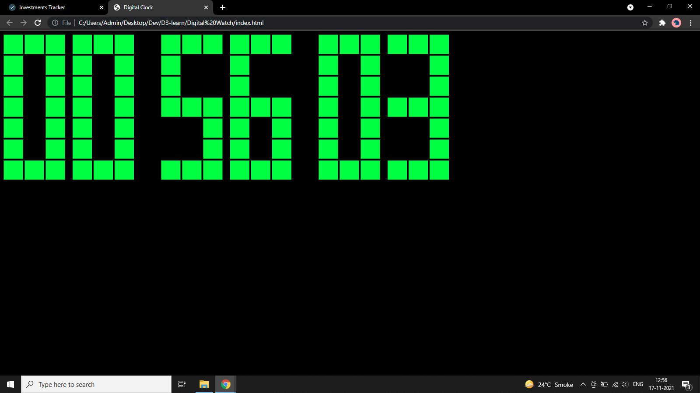
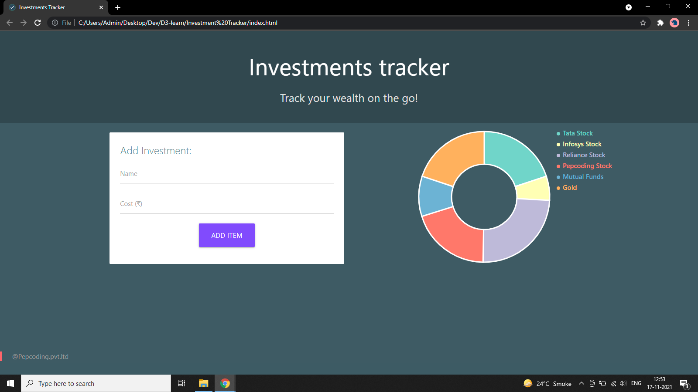
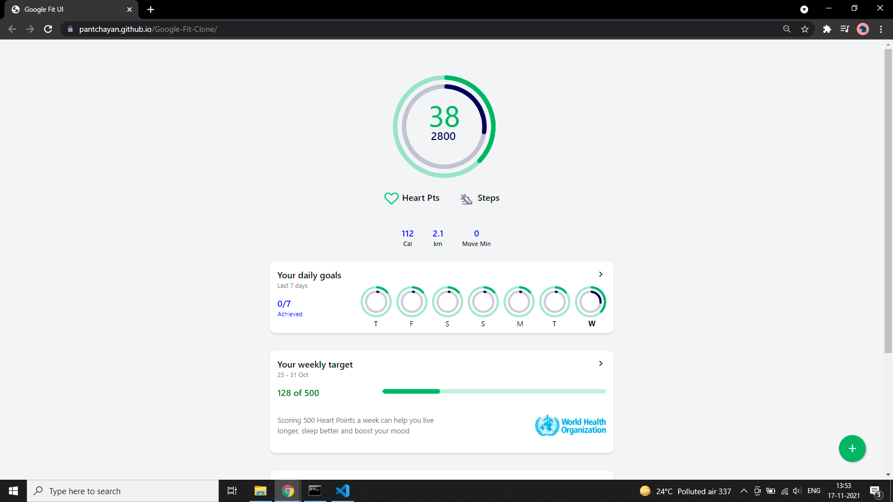
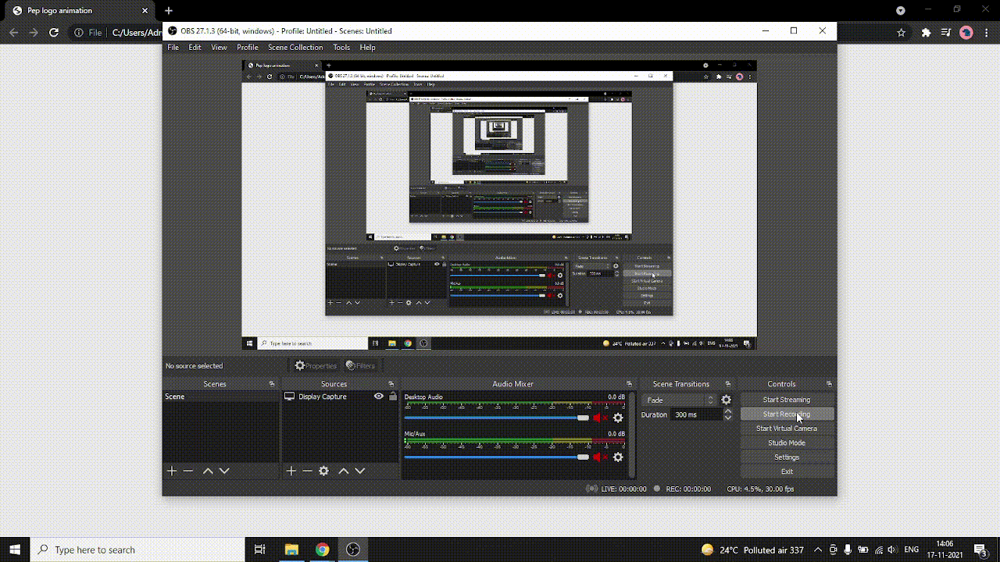

# Course Outlines

## 2D Visualisations and Animations using D3.js

 

### 1. Intro to the course

-> D3.js is a library that helps us visualise data using SVGs.  
-> Show the official page and examples  
-> Sneak peak into the course
 
-> Pre-requisites
 
-> How to go about the course? EXplain Flow and Best practices
 

 

## Module 1 - SVG basics

 

### 2. What are SVGs ?

-> Explain in detail how SVGs work.  
-> How they are more efficient than JPGs and PNGs  
-> Introduce SVG tags in HTML

### 3. Shapes in SVGs

-> Introduce < rect >, < circle >, < text >, < path > tags  
-> Dive deep into < path > tag and explain about _d string attribute_  
(As D3.js is all about manipulating these complex d strings) 

### 4. Bonus: Advantages of SVG and free resources

-> Why switch graphics to SVG from PNG and JPEG? 
-> Free resources to do so. 
-> Next up D3.js 
 

## Module 2 - D3.js Basics

 

### 5. Let's get started with D3.js (Intro)

-> Setting up D3
 
-> Data driven modification
 
-> Loading and Transforming
 

### 6. DOM Operations with D3

-> D3 DOM operations (Selection, Insertion, Updation)
 
-> Chaining methods and attributes in D3
(build a simple square and perform all these activities)

### 7. Shapes in D3

-> Build shapes using D3 and relate it to how we did it in 1st Module  
-> Texts in D3

### 8. Groups in D3

-> Grouping elements in D3  
-> Helps transforming multiple elements at once  
-> Explain using an example

### 9. Using Data with D3

-> Explain data usage and joining using a rect  
-> Update height, width, and color  
-> Use arrow functions  

### 10. Joining to multiple Rects

-> Make a Bar graph structure with rects  
-> Update values and change height and color

### 11. Enter Selection in D3.js

-> Explain problem with previous method  
-> Introduce Enter selection and Updating
 
 

## Module 3 - Digital Clock (Mini Project)

https://github.com/pantchayan/D3-learn/tree/main/Digital%20Watch

 

### 12. Overview of the project

-> List out the features and knowledge being used  
-> Set up project files

### 13. Logic for the clock

-> Explain the logic and structure behind implementation
 
-> Calling setInterval at every second and running render function to update digits
 
-> Code the above point and log out the time in console

### 14. Making a single digit

-> Explain how we can make a digit by grouping squares in D3
 
-> Data matrix of 0s and 1s
 
-> Make the digit count till 0-9

### 15. \*\* Implement structure for 6 digits

### 16. \*\* Make the clock work

### 17. Add styles and Refactor code

### 18. Discuss learning outcomes

-> D3.js basics till enter selection

 
 

## Module 4 - Graphs and Charts using D3.js

### 19. Lets make Bar graphs
-> How to go about it

### 20. Scales in D3
-> Why we need scales  
-> Linear scales  
-> Band scales  

### 21. Making rects for Bar Chart
-> Importing data from JSON 
 
-> Drawing rects 
 
-> Updating positions (Maths) to match x-y axes

### 22. Axes Groups
-> Making axis in D3
 
-> Axis groups implementation 

### 23. Hooking up Firestore (Real time updation)
-> Firestore integration to the project.
 
-> Get data from firestore and log to console

### 24. D3 Optic Pattern (Updating elements)
-> Creating update function 
 
-> Explain: Enter and Exit selection
 
-> D3 Interval function
 
-> Explain steps

### 25. Join method in D3
-> Simpler way out 

### 26. Transitions in D3
-> Intro to simple transitions  
-> Make bar graph enter and update smooth

### 27. Tweens and Interpolations
-> Give intro, and explain how basic transitions are easy

 
 

## Module 5 - Investment Tracker (Doughnut Chart)
https://github.com/pantchayan/D3-learn/tree/main/Investment%20Tracker
 

### 27. Overview of the project
-> List out the features and knowledge being used  
-> Set up project files

### 28. HTML and CSS Template
-> Use Bootstrap  
-> No need to code live: Just explain the code.

### 29. Integrate Firestore and Define schema
-> Use index.js to push data to the db
 
-> Use graph.js to retrieve data

### 30. Pie charts and arcs
-> Explain in detail how arcs are formed
-> .pie() function 
-> .arc() function
-> Pie chart to Doughnut chart conversion

### 31. Ordinal Scale

-> Bringing colors to the chart

### 32. Making Update function

-> d3 optic pattern in action

### 33. Enter and Update Tween

-> Adding transitions to data updation and initial injestion

### 34. Adding Legend

-> Adding circles
 
-> Adding texts

### 35. User Interactivity in D3
-> Handle Mouse events and hover   
-> Click : Delete the item  
-> Hover : Show Details and Opacity change  

### 36. Ending notes and Learning Outcomes

 
 

## Module 6 - More in D3.js

###  37. How to make elements Responsive

3 ways :
<ol>
    1. Event listener
</ol>
<ol>
    2. View box (Design course stuff)
</ol>
<ol>
    3. Media query + Event Listener
</ol>

### 38. Line graphs in D3

-> Make a simple line graph to demonstrate

### 40. **Racing graphs

-> Look into it... 

 
 

## Module 7 - Google Fit UI 

### 41. Overview of the project
-> Setting up project files
 
-> Discussion on flow / knowledge

### 42. HTML, CSS Template
-> Using a bit of Tailwind CSS

### 43. Make the main rings (Steps and heart points)
-> Use dummy data to make rings

### 44. Make the central numbers

### 45. Hook up Local Storage
-> Use user input data to update the rings

### 46. Update main stats

### 47. Make daily rings

### 48. Make weekly target bar

### 49. Make daily steps bar graph

### 50. Make energy expended bar graph

### 51. Finishing up the project and Learning outcomes

 

 

## Module 8 - SVG animations
https://github.com/pantchayan/D3-learn/tree/main/SVG%20Animations

### 52. Intro to SVG Animations
-> How SVG animations are better than gifs and videos?  
-> How can D3 help? Very clean and systematic animations

### 53. Pepcoding logo animation

### 54. NADOS logo animation

 

 

## Module 9 - SVG Football Game

https://github.com/pantchayan/football-game

### 55

### 56

### 57

### 58

### 59

### 60

 

